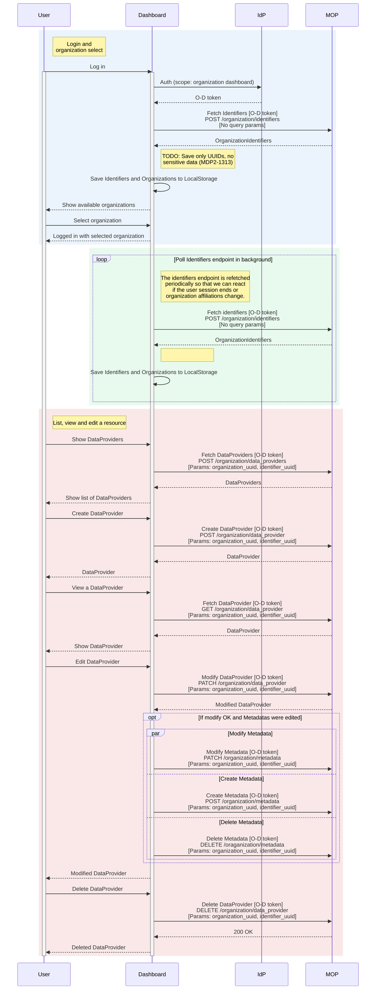

# MyDataShare Dashboard

## Overview

Dashboard is a tool for customers to manage the MyDataShare assets owned by their organization.

Dashboard provides the following features: 

- Authentication of the user
- Creation, editing and deletion of data consumer, data provider and access gateway entities
- Creation of processing records either individually or based on group membership 
- Creation of support requests (e.g. new clients or sub-organizations) 
- Management of organizational users 

In order to utilize Dashboard against the MyDataShare test environment, you must obtain the client credentials from the MyDataShare administrators

## Architecture

### User login and general API use sequence diagram 



## Configuration 

Dashboard configuration settings are controlled using environment variables.

### `REACT_APP_IDP_CLIENT_ID` (required*)

**Example: `REACT_APP_IDP_CLIENT_ID`: `some-dashboard-client-id`**

### `REACT_APP_MDS_API_URL` (required)

**Example: `https://api.beta.mydatashare.com`**

Base URL for the MDS API to use.

### `REACT_APP_AUTH_ITEM_NAMES` (required)

**Example: `Log in with a randomly generated user;Log in with a test user`**

A semicolon separated list of MDS API AuthItems to display as login methods specified by their `name` field.

## Development 

### Running via Docker Image

Starting a clean environment:

```
docker-compose up --build devserver
```
